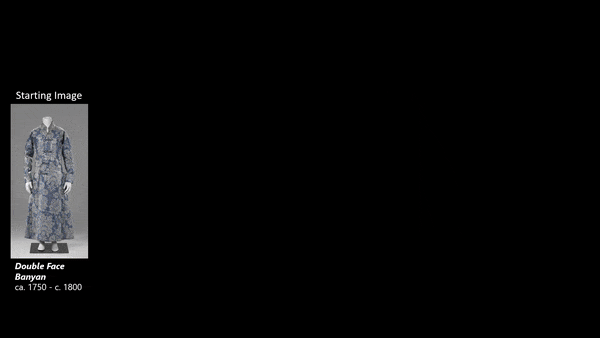
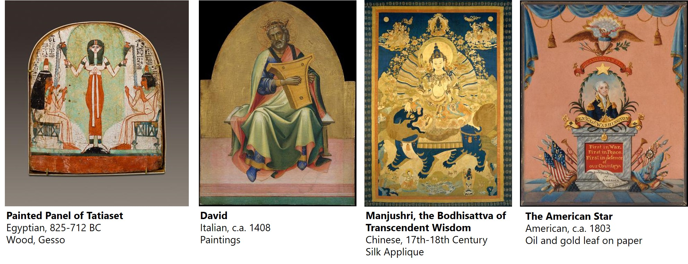
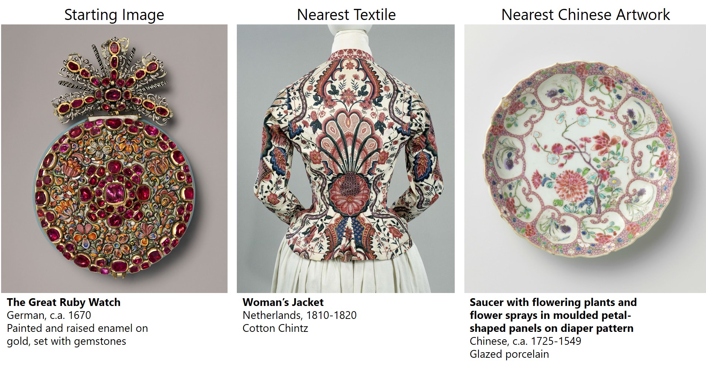
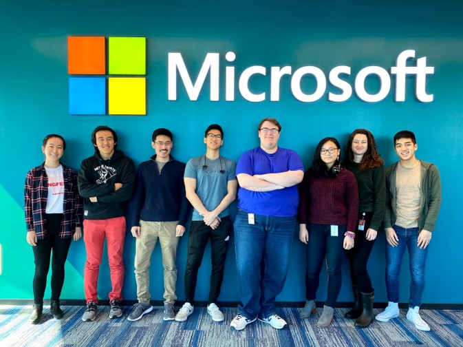

<p align="center">
<a href="https://aka.ms/mosaic" target="_blank">
  
  </a>
</p>

## [Live Demo at aka.ms/mosaic](https://aka.ms/mosaic)

To access the search functionality, [apply to access the mosaic beta](https://forms.microsoft.com/Pages/DesignPage.aspx#FormId=v4j5cvGGr0GRqy180BHbR3nswihwe8JLvwovyYerymVUQlUzOE9VVDUyQjlJUzRFQ1pQUEJDN001Wi4u)

## About

Art is one of the few languages which transcends barriers of country, culture, and time. We aim to create an algorithm that can help discover the common semantic elements of art even between **any** culture, media, artist, or collection within the combined artworks of [The Metropolitan Museum of Art](https://www.metmuseum.org/) and [The Rijksmusem](https://www.rijksmuseum.nl/en). 

### Conditional Image Retrieval

<p align="center">
  
</p>

Image retrieval systems allow individuals to find images that are semantically similar to a query image. This serves as the backbone of reverse image search engines and many product recommendation engines. 
We presents a novel method for specializing image retrieval systems called conditional image retrieval. When applied over large art datasets in particular, conditional image retrieval provides visual analogies that bring to light hidden connections among different artists, cultures, and media. Conditional image retrieval systems can efficiently find shared semantics between works of vastly different media and cultural origin. [Our paper](https://arxiv.org/abs/2007.07177) introduces new variants of K-Nearest Neighbor algorithims that support specializing to particular subsets of image collections on the fly. 

### Deep Semantic Similarity

To find artworks with similiar semantic structure we leverage "features" from deep vision networks trained on ImageNet. These networks map images into a high-dimensional space where distance is semantically meaningful. Here, nearest neighbor queries tend to act as "reverse image search engines" and similiar objects often share common structure.

<p align="center">
  
</p>

### Architecture

<p align="center">
  
</p>

## Webinar
To learn more about this project please join our [live webinar](https://note.microsoft.com/MSR-Webinar-Visual-Analogies-Registration-Live.html) on 10AM PST 7/30/2020.

<p align="center">
<a href="https://note.microsoft.com/MSR-Webinar-Visual-Analogies-Registration-Live.html" target="_blank">
  
</a>
</p>

## Paper

- Hamilton, M., Fu, S., Freeman, W. T., & Lu, M. (2020). Conditional Image Retrieval. arXiv preprint [arXiv:2007.07177](https://arxiv.org/abs/2007.07177).

To cite this work please use the following:
```
@article{hamilton2020conditional,
  title={Conditional Image Retrieval},
  author={Hamilton, Mark and Fu, Stephanie and Freeman, William T and Lu, Mindren},
  journal={arXiv preprint arXiv:2007.07177},
  year={2020}
}
```

## Developer Guide

Please see our [developer guide](./developer_guide.mg) to build the project for yourself.

## Some Favorite Matches

Shared portrayals of reverence over 3000 years:

<p align="center">
  
</p>

How to match your watch to your outfit and your dinnerware:

<p align="center">
  
</p>

## Contributors

Special thanks to all of the contributors who helped make this project a reality!

#### Project Leads
- [Mark Hamilton](https://mhamilton.net)
- Chris Hoder

#### Collaborators
- [Professor William T Freeman](https://billf.mit.edu/)
- [Lei Zhang](https://www.microsoft.com/en-us/research/people/leizhang/)
- Anand Raman
- Al Bracuti
- Ryan Gaspar
- Christina Lee
- Lily Li

#### MIT x MSFT Garage 2020 Externship Team:

<p align="center">

</p>

 The MIT x MSFT externs were pivotal in turning this research project into a functioning website. In only one month, the team built and designed the mosaic website. Stephanie Fu and Mindren Lu also contributed to the "Conditional Image Retrieval" publication through their evaluation of the affect of different pre-trained networks on nonparametric style transfer.

Students
- Stephanie Fu
- Mindren Lu 
- Zhenbang (Ben) Chen
- Felix Tran 
- Darius Bopp 
- Margaret (Maggie) Wang
- Marina Rogers 
- Johnny Bui 

#### MSFT Garage Staff and Mentors
This project owes a heavy thanks to the MSFT Garage team. They are passionate creators who seek to incubate new projects and inspire new generations of engineers. Their support and mentorship on this project are sincerely appreciated.
- Chris Templeman
- Linda Thackery 
- Jean-Yves Ntamwemezi
- Dalitso Banda
- Anunaya Pandey

## Contributing

This project welcomes contributions and suggestions.  Most contributions require you to agree to a
Contributor License Agreement (CLA) declaring that you have the right to, and actually do, grant us
the rights to use your contribution. For details, visit https://cla.opensource.microsoft.com.

When you submit a pull request, a CLA bot will automatically determine whether you need to provide
a CLA and decorate the PR appropriately (e.g., status check, comment). Simply follow the instructions
provided by the bot. You will only need to do this once across all repos using our CLA.

This project has adopted the [Microsoft Open Source Code of Conduct](https://opensource.microsoft.com/codeofconduct/).
For more information see the [Code of Conduct FAQ](https://opensource.microsoft.com/codeofconduct/faq/) or
contact [opencode@microsoft.com](mailto:opencode@microsoft.com) with any additional questions or comments.
